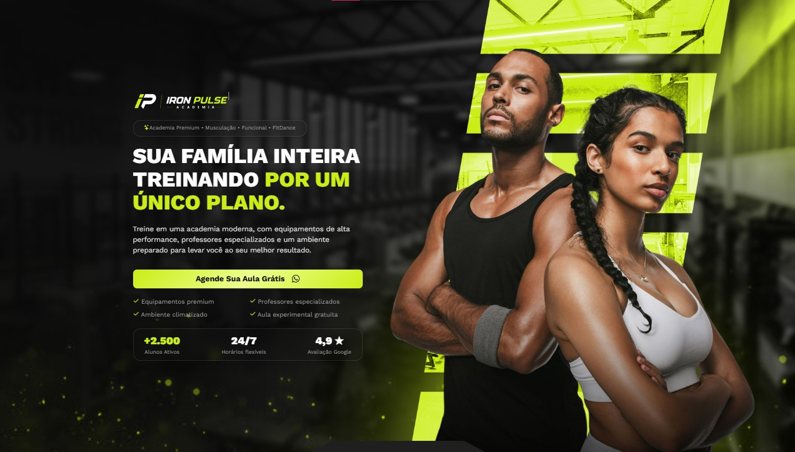
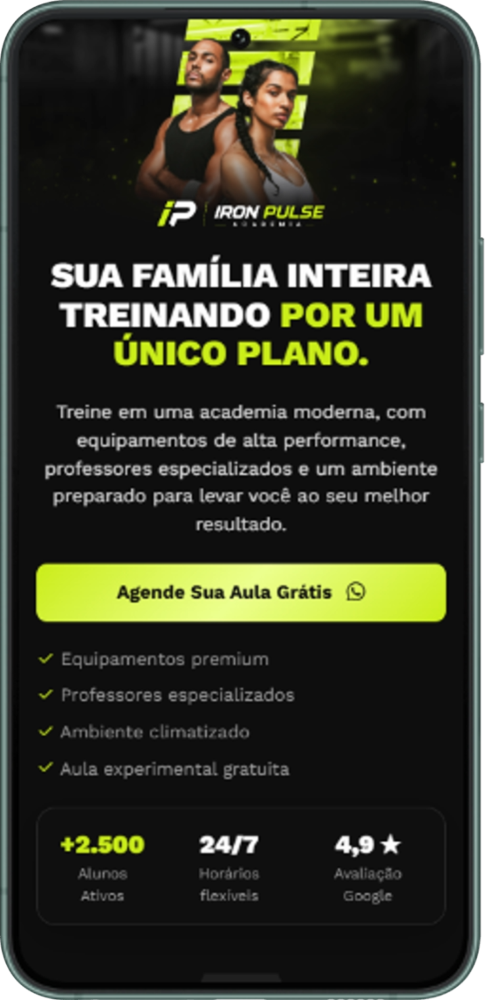

# 💪 Iron Pulse Academy

Uma landing page moderna para academia, desenvolvida com foco em design, responsividade, performance e experiência do usuário.

---

## 📸 Preview

### Desktop

  

### Mobile

  

---

## ✨ Funcionalidades

- Layout 100% responsivo
- Design moderno e intuitivo
- Navegação suave entre seções
- Animações e efeitos visuais
- Seções informativas sobre a academia
- Chamada para ação (CTA)
- Estrutura otimizada para SEO
- Código organizado e de fácil manutenção

---

## 🚀 Tecnologias

- HTML5
- CSS3
- JavaScript (ES6+)
- Bootstrap Icons
- Google Fonts

---

## 🌐 Demonstração

🔗 **Acesse o projeto:**

> https://ironpulseclub.vercel.app/

---

## 🎯 Objetivo

Este projeto foi desenvolvido para praticar a criação de interfaces modernas, aplicando conceitos de responsividade, organização de código, animações e boas práticas de desenvolvimento Front-End.

---

## 📄 Licença

Este projeto está disponível para fins de estudo e desenvolvimento pessoal.
